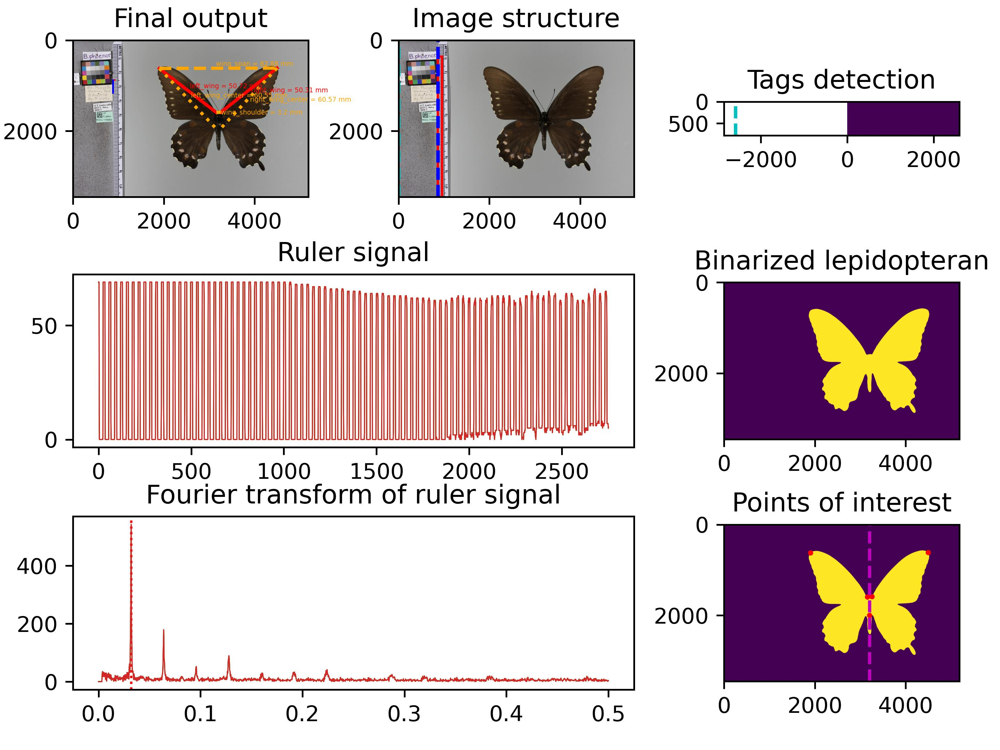
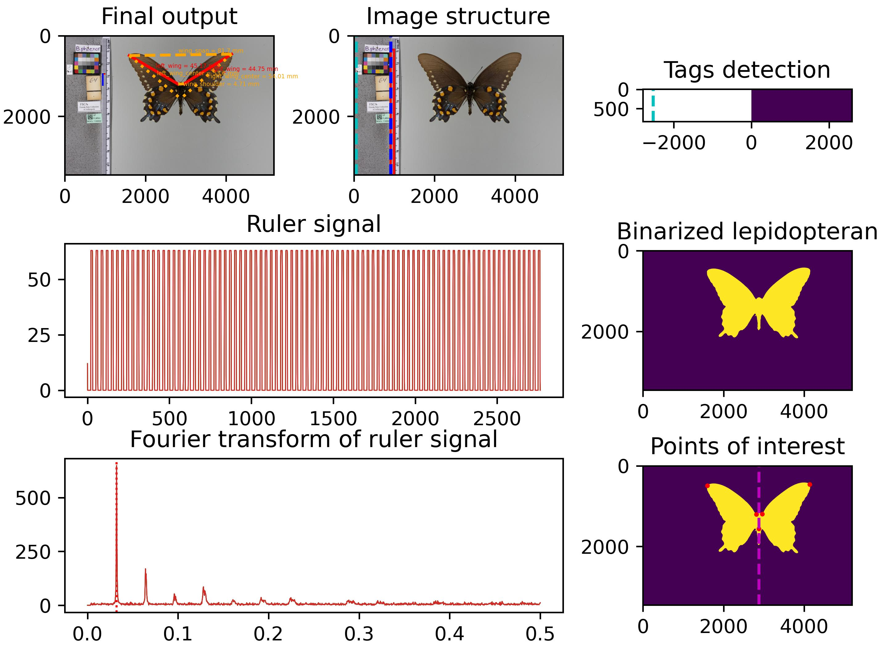

Mothra analyzes images of lepidopterans — mainly butterflies and moths — and measures their wing lengths. Using binarization techniques and calculating the resolution of ruler ticks, we read in images of lepidopterans and output the millimeter lengths of their wings.

## Goal
- Adapted for UF Museum samples
- extract specific details and measurements of body sizes for each image in the UF Museum dataset "../UF_museum_data_2023/231017_Battus_philenor_polydamas_FLMNH.csv"

### Environment Setup
- Python 3.8.18 Installation via Miniconda v23.1.0 - https://docs.conda.io/projects/miniconda/en/latest/ 
```
conda env remove -n mothra
conda create -n mothra python=3.8
conda activate mothra
```
- Install packages ` pip install -r requirements.txt`

### Evaluate on UF Battus samples
- Test run on Battus10
  ```
  time python pipeline_battus.py --detailed_plot -ar -i ./data/battus10/val_images/images -o ./data/battus10/results/val_images -csv ./data/battus10/results/val_images/results.csv
  ```
  - Result output in 4m29s
  ```
  Image 1/2 : IMG_3870.JPG
      Cannot evaluate orientation for ./data/battus10/val_images/images/IMG_3870.JPG.
      Couldn't determine EXIF image angle
      Skip weight check and use the local weights:  models/battus10_segmentation_test-4classes-resnet18-b2-e20.pkl
      Processing U-net...
      Result shape:  torch.Size([4, 3456, 5184])
      Lepidopteran: BBox -  574 1867 2876 4522
      Ruler row(min,max)=74,3455, col(min,max)=868,1099
      Focus shape (y,x)- (3381, 231)
      T space - 31.44186046511628
      x single - [871, 902.4418604651163]
      x multpl - [871, 1185.4186046511627]
      Ruler row(min,max)=74,3455, col(min,max)=868,1099
      Focus shape (y,x)- (3381, 231)
      T space - 31.44186046511628
      x single - [871, 902.4418604651163]
      x multpl - [871, 1185.4186046511627]
      Skip weight check and use the local weights:  models/battus10_segmentation_test-4classes-resnet18-b2-e20.pkl
      Processing U-net...
      Result shape:  torch.Size([4, 3456, 5184])
      Lepidopteran: BBox -  574 1867 2876 4522
      Ruler row(min,max)=74,3455, col(min,max)=868,1099
      Focus shape (y,x)- (3381, 231)
      T space - 31.44186046511628
      x single - [871, 902.4418604651163]
      x multpl - [871, 1185.4186046511627]
      Skip weight check and use the local weights:  models/battus10_segmentation_test-4classes-resnet18-b2-e20.pkl
      Processing U-net...
      Result shape:  torch.Size([4, 3456, 5184])
      Lepidopteran: BBox -  574 1867 2876 4522
      Ruler row(min,max)=74,3455, col(min,max)=868,1099
      Focus shape (y,x)- (3381, 231)
      T space - 31.44186046511628
      x single - [871, 902.4418604651163]
      x multpl - [871, 1185.4186046511627]
  Measurements:
  * left_wing: 50.05 mm
  * right_wing: 50.05 mm
  * left_wing_center: 60.23 mm
  * right_wing_center: 60.28 mm
  * wing_span: 82.37 mm
  * wing_shoulder: 3.72 mm
  Identifying position and gender...
  * Could not calculate position and gender

  ```
  - 
  ```
  Image 2/2 : IMG_4541.JPG
      Cannot evaluate orientation for ./data/battus10/val_images/images/IMG_4541.JPG.
      Couldn't determine EXIF image angle
      Skip weight check and use the local weights:  models/battus10_segmentation_test-4classes-resnet18-b2-e20.pkl
      Processing U-net...
      Result shape:  torch.Size([4, 3456, 5184])
      Lepidopteran: BBox -  418 1584 2174 4154
      Ruler row(min,max)=58,3455, col(min,max)=915,1129
      Focus shape (y,x)- (3397, 214)
      T space - 30.886363636363633
      x single - [915, 945.8863636363636]
      x multpl - [915, 1223.8636363636363]
      Ruler row(min,max)=58,3455, col(min,max)=915,1129
      Focus shape (y,x)- (3397, 214)
      T space - 30.886363636363633
      x single - [915, 945.8863636363636]
      x multpl - [915, 1223.8636363636363]
      Skip weight check and use the local weights:  models/battus10_segmentation_test-4classes-resnet18-b2-e20.pkl
      Processing U-net...
      Result shape:  torch.Size([4, 3456, 5184])
      Lepidopteran: BBox -  418 1584 2174 4154
      Ruler row(min,max)=58,3455, col(min,max)=915,1129
      Focus shape (y,x)- (3397, 214)
      T space - 30.886363636363633
      x single - [915, 945.8863636363636]
      x multpl - [915, 1223.8636363636363]
      Skip weight check and use the local weights:  models/battus10_segmentation_test-4classes-resnet18-b2-e20.pkl
      Processing U-net...
      Result shape:  torch.Size([4, 3456, 5184])
      Lepidopteran: BBox -  418 1584 2174 4154
      Ruler row(min,max)=58,3455, col(min,max)=915,1129
      Focus shape (y,x)- (3397, 214)
      T space - 30.886363636363633
      x single - [915, 945.8863636363636]
      x multpl - [915, 1223.8636363636363]
  Measurements:
  * left_wing: 45.76 mm
  * right_wing: 45.24 mm
  * left_wing_center: 54.05 mm
  * right_wing_center: 54.41 mm
  * wing_span: 82.47 mm
  * wing_shoulder: 4.72 mm
  Identifying position and gender...
  * Could not calculate position and gender
  ```
  - 

- Rest run on Battus100
  ```
  time python pipeline_battus.py --detailed_plot -ar -i ./data/battus100/val_images/images -o ./data/battus100/results/val_images -csv ./data/battus100/results/val_images/results.csv
  ```
  ```log
  TODO
  ```
--- 

### Issues: [TODO]
- [x] Re-trained the segmentation model with new data for clean ruler segments [Apr/10/2024]
- [x] Ruler segments analysis code is not working. [Mar/20/2024] 
- [ ] Run evaluation on val images and report results
- [ ] Compute the Accuracy metrics on evaluation images
- [ ] Compute the RMSe metric on the manual measurement ground truth


#### Validate and measure accuracy
- Add wingspan, left, right measurements in "mm" to the battus 100 dataset 
    - subset the larger metadata excel sheet based on the filename [Rahul]
    - share the set with Vineesha for adding the actual measurement as ground truth information [Vineesha]
        - Add columns [image_id	left_wing (mm)	right_wing (mm)	left_wing_center (mm)	right_wing_center (mm)	wing_span (mm)	wing_shoulder (mm)]
- Run the analysis for all 100 images using mothra [Rahul]
    - evaluate the results accuracy based on the human labeled ground truth (length in mm)
    - tune or tweak the model to obtain the best accuracy possible given the measurements
- Run the model on all musuem specimens to generate results [Rahul]
- Spot check the results on random 100 images to verify the measurements correctness [Vineesha]


--- 

